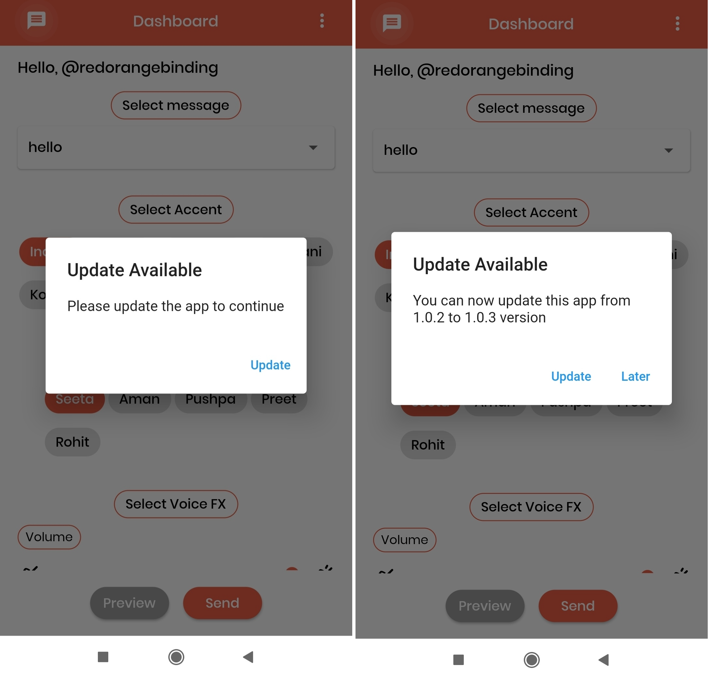

# at_newversion_notification

A new Flutter project.

* This flutter package alert the user to update the application into a new updated version.
* With the help of an alert pop-up, users can easily navigate to the appropriate Play Store or App Store Page.

## UI
The UI of the alert dialog is simply a card.

Screenshots:



## Installation
Add at_newversion_notification as [a dependency in your `pubspec.yaml` file.](https://flutter.io/using-packages/)
```
dependencies:
  at_newversion_notification: ^0.0.1
```
## Usage
* In main.dart file, first create an instance of the `AtNewVersionNotification` class in your `initState()` method.

   `final AtNewVersionNotification appNewVersionNotific = AtNewVersionNotification();`

* Then Find your application package name and pass the value in andoidAppId, iOSAppId and
pass `minimum version` in minimumVersion parameter.

* And calling showAlertDialog method with your app. BuildContext will check if the app is applicable for updates or not. And based on the platform the alert dialog will automatically open then the user can go to the app store.

   `atNewVersionNotific.showAlertDialog(context: context);`

## Example
```
 import 'package:flutter/cupertino.dart';
 import 'package:flutter/material.dart';
 import '/at_new_version_notification.dart';

 class Example extends StatefulWidget {
   const Example({Key? key}) : super(key: key);

   @override
   _ExampleState createState() => _ExampleState();
 }

 class _ExampleState extends State<Example> {
   @override
   void initState() {
     super.initState();

     final AtNewVersionNotification appNewVersionNotific =
         AtNewVersionNotification(
             iOSAppId: 'com.google.myride',
             androidAppId: 'com.google.rever',
             minimumVersion: '1.0.0');

     showDialog(appNewVersionNotific);
   }

   void showDialog(AtNewVersionNotification appNewVersion) {
     appNewVersion.showAlertDialog(context: context);
   }

   @override
   Widget build(BuildContext context) {
     return Scaffold(
       body: Container(),
     );
   }
 }
 ```


